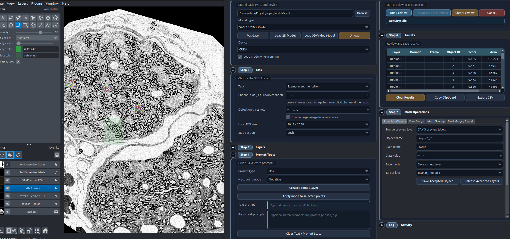
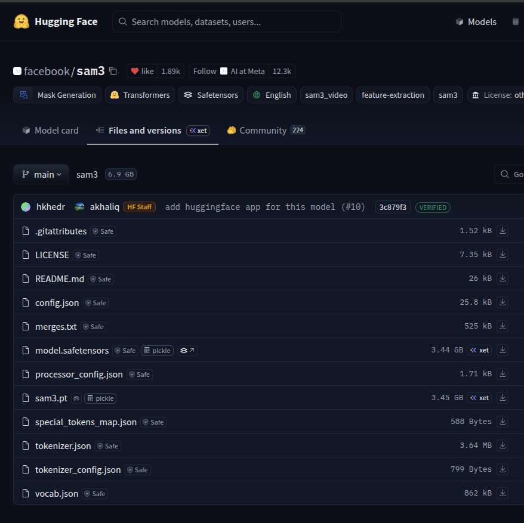

# napari-sam3-assistant



`napari-sam3-assistant` is a napari plugin for interactive Segment Anything Model 3 (SAM3) segmentation using text, points, boxes, exemplar prompts, large-image ROI inference, point-based refinement, mask operations, and 3D/video-like propagation.

The plugin focuses on task-based segmentation workflows:

- 2D segmentation with text, box, point, and mask-style prompts
- 3D stack / video-like propagation from prompts on a selected slice or frame
- exemplar segmentation from Shapes ROI boxes
- text-based concept segmentation
- large OME-Zarr and TIFF segmentation through local ROI inference
- refinement with positive and negative point prompts
- downstream mask cleanup, merge, and export operations

SAM 3 is not bundled with this plugin. Install the SAM 3 backend and download the SAM 3 model files separately from Meta's Hugging Face repository.

## Status

This project is under active development. The current widget supports local SAM 3 model loading, napari prompt collection, large-image ROI execution, downstream mask operations, background execution, and writing results back to napari layers.

## Changelog

### 3.0.0

Major update compared with 2.0.0, focused on large-image segmentation, Step 7 mask operations, workflow modularization, and bug fixes.

Added:

- Optional large-image local inference mode for OME-Zarr, large TIFF, and similar very large images, including images on the order of `60000 x 50000` pixels when the data source can provide lazy ROI reads.
- Local ROI inference with selectable ROI sizes from `512 x 512` through `8192 x 8192`.
- Active ROI overlay layer showing the current SAM3 local inference window in global image coordinates.
- Step 7 `Mask Operations` workflow for accepting, cleaning, merging, and exporting segmentation masks.
- Accepted-object saving with object name, class name, class value, append, and replace modes.
- Class-level merge workflow for accepted object layers.
- Mask cleanup tools for connected-component analysis, deleting selected components, removing small objects, filling holes, smoothing masks, keeping the largest object, and relabeling values.
- Final merge/export tools for semantic, instance, and binary output masks.
- Overlap handling during final mask merge with priority, selection-order, component-size, and background rules.
- Mask export to TIFF, PNG, and NumPy `.npy`.
- Task-runner modules for image, refinement, and video workflows to keep the main widget easier to maintain.

Changed:

- Large-image ROI choices now include `4096 x 4096` and `8192 x 8192`.
- README now documents the large-image workflow and Step 7 mask operations.
- Result writing handles ROI-local outputs and maps them back into global image coordinates.
- Prompt collection and coordinate utilities support ROI-local conversion for large-image workflows.

Fixed:

- Improved coordinate handling for local ROI segmentation on large images.
- Improved preview/result layer handling for ROI-local outputs.
- Added tests for ROI extraction, prompt localization, global result mapping, and Step 7 UI presence.

### 2.0.0

Major update focused on SAM3.1 support, clearer model selection, live refinement, and result handling.

Added:

- SAM3.1 video multiplex support through `sam3.1_multiplex.pt`.
- Explicit `Model type` selector:
  - `SAM3.0 2D/3D/video`
  - `SAM3.1 video multiplex`
- Model-type-aware validation so SAM3.0 and SAM3.1 folders are not confused.
- SAM3.1 routing for 3D/video propagation through the multiplex video predictor.
- Automatic task guidance for SAM3.1: `Load 2D Model` is disabled and the task is set to `3D/video propagation`.
- Two-column step-based widget layout:
  - left column: `Model Setup`, `Task`, `Layers`
  - right column: `Prompt Tools`, `Run`, `Results`, and collapsible `Status`
- Muted professional widget theme for lower eye strain during long napari sessions.
- Compact activity indicator in `Run` showing model execution, propagation, refinement, idle, and failure states.
- Results table showing `Layer`, `Prompt`, `Frame`, `Object ID`, `Score`, and `Area`.
- Detection threshold control for SAM3 grounding, useful when text prompts return no candidates.
- More visible text prompt input with `Enter` bound to `Run Preview`.
- Text prompt cleanup that sends short model-facing phrases such as `myelin ring` instead of instruction text such as `segment all the myelin ring`.
- Automatic lower-threshold retry for text segmentation when the first pass returns zero objects.
- Batch mode for running the same 2D prompt setup across all open image layers, with separate preview and saved label layers per image.
- Multi-text batch mode: enter one text concept per line and run each prompt independently against the selected image or all image layers.
- Results actions:
  - `Clear Results`
  - `Copy Clipboard`
  - `Export CSV`
- Label-value merge controls for converting multiple label IDs into one class value.
- Stable object-ID label mapping for propagated video/stack results.
- Remembered model type, model directory, and device selection through Qt settings.
- Safer CUDA error reporting for unsupported GPU kernel architectures.

Live refinement improvements:

- `Refinement (live point correction)` mode now arms live point refinement immediately after `Create Prompt Layer`.
- The first point starts live refinement; the first run may take longer if the model is lazy-loaded.
- `SAM3 preview labels` is pre-created for live refinement so napari does not switch users away from the points layer after the first result.
- After each live refinement update, the active layer returns to `SAM3 points` in add mode.
- `Next point mode` affects only future points.
- `T` toggles next point mode only and does not rerun refinement.
- `Shift+T` flips selected point polarity, or the latest point if none is selected, and reruns refinement.
- Existing dot colors now change only when stored point `properties["polarity"]` changes.
- `Apply mode to selected points` still edits selected existing points and reruns preview.

Changed:

- `Backend / Model Setup` was renamed to `Model Setup`.
- `Napari Layers` was renamed to `Layers`.
- `Batch all image layers` can be used independently from multi-text prompts.
- `Load Image Model` was renamed to `Load 2D Model`.
- `Lazy-load on run` was renamed to `Load model when running`.
- Text prompts no longer require a prompt layer.
- Text prompt submission can be run with `Enter` without moving to the `Run Preview` button.
- Preview clearing removes generated preview layers only and keeps prompts, saved labels, and loaded models.
- `pytorch_model.bin` was removed from documented and validated model-file names.

Current model support:

- SAM3.0 weights support 2D image tasks and 3D/video propagation.
- SAM3.1 `sam3.1_multiplex.pt` supports 3D/video propagation.
- SAM3.1 is not currently routed through the plugin's 2D image model loader.

### 1.0.0

Initial SAM3 Assistant plugin foundation.

Added:

- Local SAM3 backend adapter for napari workflows.
- Task-based UI for:
  - 2D segmentation
  - 3D stack/video-like propagation
  - exemplar segmentation
  - text segmentation
  - refinement with positive and negative prompts
- Prompt collection from napari Points, Shapes, Labels, and text input.
- Box prompts from Shapes layers.
- Labels-layer mask prompts.
- Text prompts for concept segmentation.
- Preview outputs as napari Labels, Image, and Shapes layers.
- Saved label outputs through `Save Result as Labels`.
- Background worker execution to keep the napari UI responsive.
- Channel-axis handling for grayscale, RGB/RGBA, channel-first, and stack-like data.
- Basic model-directory validation for local SAM3 files.

## Requirements

- Python `>=3.12`
- napari `>=0.5`
- SAM 3 Python package importable as `sam3`
- PyTorch and torchvision installed for your platform
- A local SAM 3 checkpoint directory containing:
  - `config.json`
  - `processor_config.json`
  - one weight file such as `sam3.pt`, `model.safetensors`, or `sam3.1_multiplex.pt`

If CUDA is not available or not compatible, select **CPU** in the widget.

## Setup

### Important for Windows users

If you installed the standalone napari desktop app from the website, Plugin Manager may not work for this plugin because that app uses a different Python environment.

For Windows, use a **new Conda environment with Python 3.12** and install napari, SAM 3, and `napari-sam3-assistant` there.

## Windows install in PowerShell

```powershell
# 1) install Miniforge first from:
# https://conda-forge.org/download/

# 2) open Miniforge Prompt or PowerShell after Miniforge is installed


conda create -n napari-sam3 python=3.12 -y
conda activate napari-sam3

python -m pip install --upgrade pip wheel
python -m pip install "setuptools<82"
python -m pip install "napari[all]"

# choose one:
python -m pip install torch torchvision torchaudio --index-url https://download.pytorch.org/whl/cpu
# or
python -m pip install torch torchvision torchaudio --index-url https://download.pytorch.org/whl/cu128

python -m pip install --no-cache-dir sam3
python -m pip install einops triton-windows pycocotools
python -m pip install napari-sam3-assistant

napari
```

## Download SAM 3 model files

Download the model files from:

- `https://huggingface.co/facebook/sam3`
- `https://huggingface.co/facebook/sam3.1`

These repositories are gated, so you must request or accept access first.

After approval, download the files manually from the **Files and versions** tab.

A reference screenshot of the file list is shown below:



## Model folder

The model files can be stored in any folder you want.

Examples:

```text
D:\models\sam3
D:\models\sam3_1

```

The plugin only needs the correct folder path.

Example SAM3.0 folder:

```text
D:\models\sam3\
  config.json
  processor_config.json
  sam3.pt
```

`model.safetensors` is also supported as a SAM3 3.0 weight file.

Example SAM3.1 folder:

```text
D:\models\sam3_1\
  config.json
  processor_config.json
  sam3.1_multiplex.pt
```

Current model support:

- SAM3.0 weights: 2D image tasks and 3D/video propagation
- SAM3.1 `sam3.1_multiplex.pt`: 3D/video propagation through the SAM3.1 multiplex video predictor
- SAM3.1 is not currently routed through the plugin's 2D image model loader


## Device rule

- If you installed CPU-only PyTorch, choose **CPU**
- If you installed CUDA PyTorch and `torch.cuda.is_available()` is `True`, you may choose **CUDA**

## For developers

If you want editable installs and `git pull`, use:

```powershell
git clone https://github.com/facebookresearch/sam3.git
cd sam3
python -m pip install --no-cache-dir -e .

git clone https://github.com/wulinteousa2-hash/napari-sam3-assistant.git
cd napari-sam3-assistant
python -m pip install -e .
```

## Basic Workflow

1. Open an image in napari.
2. Open `Plugins > SAM3 Assistant`.
3. Select the image in `Layers > Image`.
4. Select a task.
5. Create a prompt layer if the task needs one.
6. Click `Run Preview`.
7. Inspect `SAM3 preview labels`, `SAM3 preview masks`, or `SAM3 preview boxes`.
8. Click `Save Result as Labels` to keep the result.

Use `Clear Preview` to remove generated preview layers without deleting prompts or saved labels.

### Large-Image Local Inference

Large-image mode is optional and off by default. When it is off, the plugin keeps the existing full-image inference path.

Use this mode for OME-Zarr, large TIFF, and similar large images where sending the full selected plane to SAM3 is too expensive.

Workflow:

1. Set up the normal task and prompt type.
2. Enable `Enable large-image local inference` in `Step 2. Task`.
3. Choose a local ROI size:

```text
512 x 512
1024 x 1024
2048 x 2048
4096 x 4096
8192 x 8192
```

4. Add a point or box prompt.
5. Click `Run Preview`, or add points in live refinement mode.

ROI behavior:

- Point prompts use the latest point as the ROI anchor.
- Box prompts use the box center and keep the box inside the local inference window when possible.
- Refinement uses the latest point as the ROI anchor.
- Text-only prompts keep the full-image path in this first pass unless a point or box anchor is also available.
- If a new point or box stays inside the current ROI, the same ROI is reused.
- If a new point or box falls outside the current ROI, the ROI is rebuilt around the new prompt.

The active ROI is shown as:

```text
SAM3 active ROI
```

SAM3 receives only the local ROI image data. Returned labels and boxes are written back into global image coordinates in the normal preview layers.

Status messages report:

```text
Large-image mode OFF: full-image inference.
Large-image mode ON: local ROI inference (WIDTH x HEIGHT).
Active ROI bounds: y=Y0:Y1, x=X0:X1.
```

### Batch Multiple 2D Images

Use `Batch all image layers` when several open 2D images should receive the same prompt setup.

Workflow:

1. Open multiple images in napari.
2. Configure a 2D task such as text, box, exemplar, or labels-mask segmentation.
3. Add the prompt once.
4. Enable `Batch all image layers` in `Step 3. Layers`.
5. Click `Run Preview`.

Each source image gets its own output layers:

```text
SAM3 preview labels [image name]
SAM3 preview masks [image name]
SAM3 preview boxes [image name]
```

`Save Result as Labels` saves each batch preview labels layer separately:

```text
SAM3 saved labels [image name]
```

Batch mode is intended for 2D image tasks. It is disabled for live refinement and 3D/video propagation because those workflows depend on one active image/session.

### Multi-Text Batch Mode

Use `Batch text prompts` when you want each text concept to run independently instead of writing one combined phrase such as `cat and dog`.

Workflow:

1. Set `Task` to `Text segmentation`.
2. Enter one concept per line in `Batch text prompts`:

```text
cat
dog
person
```

3. Leave `Batch all image layers` off to run all prompts on the selected image only.
4. Enable `Batch all image layers` to run every prompt on every open image.
5. Click `Run Preview`.

Outputs include both image and prompt:

```text
SAM3 preview labels [Image 1 - cat]
SAM3 preview labels [Image 1 - dog]
SAM3 preview labels [Image 2 - cat]
SAM3 preview labels [Image 2 - dog]
```

The Results table includes a `Prompt` column. Object IDs are scoped to each image-prompt result, so `Object ID 1` for `Image 1 - cat` is separate from `Object ID 1` for `Image 1 - dog`.

## Tasks

### Text Segmentation

Use text to segment all matching instances of a concept.

Workflow:

1. Set `Task` to `Text segmentation`.
2. Leave `Prompt type` as `Text only`.
3. Enter a short phrase, for example:

```text
cell
nucleus
myelin
myelin sheath
```

4. Keep `Detection threshold` near the default `0.35`, or lower it if the result is empty.
5. Press `Enter` in the text prompt field or click `Run Preview`.

No prompt layer is needed for text segmentation. `Create Prompt Layer` is not required.

Text prompts usually work better as short noun phrases than instructions. Prefer `myelin sheath` over `segment all the myelin rings`. The plugin strips common instruction prefixes before sending the prompt to SAM3, but microscopy-specific language can still be difficult for the model.

If the result says `objects=0`, SAM3 ran but did not return masks above threshold. Try a shorter noun phrase, lower `Detection threshold`, or use a box/exemplar prompt for structures that are visually clear but not well recognized by text.

### 2D Segmentation With Boxes

Use boxes to identify the target object or concept.

Workflow:

1. Set `Task` to `2D segmentation`.
2. Set `Prompt type` to `Box`.
3. Click `Create Prompt Layer`.
4. Draw one or more rectangles in the `SAM3 boxes` Shapes layer.
5. Click `Run Preview`.

The output appears in preview layers.

### Exemplar Segmentation

Use example ROIs to segment similar objects.

Workflow:

1. Set `Task` to `Exemplar segmentation`.
2. Set `Prompt type` to `Box`.
3. Click `Create Prompt Layer`.
4. Draw boxes around one or more example objects.
5. Click `Run Preview`.

The local SAM 3 image API exposes visual exemplars through geometric box prompts. The plugin stores ROI metadata, but inference currently passes exemplar ROIs as SAM 3 visual box prompts.

### Refinement With Positive and Negative Points

Use points to correct a result.

Workflow:

1. Set `Task` to `Refinement (live point correction)`.
2. Set `Prompt type` to `Points (positive/negative)`.
3. Click `Create Prompt Layer`.
4. Choose `Positive` and add points on regions to include.
5. Choose `Negative` and add points on regions to exclude.
6. Click `Run Preview`.

This is useful after a text, box, or exemplar preview is close but not correct.

### Labels Mask Prompt

Use a napari Labels layer as a mask-style prompt.

Workflow:

1. Set a task that supports mask prompts.
2. Set `Prompt type` to `Labels mask`.
3. Click `Create Prompt Layer`.
4. Paint non-zero pixels in `SAM3 mask prompt`.
5. Click `Run Preview`.

### 3D Stack / Video Propagation

Treat a stack as video-like data and propagate a prompt through frames or slices.

Workflow:

1. Open a stack in napari.
2. Set `Task` to `3D/video propagation`.
3. Select the target frame or slice in napari.
4. Create a prompt layer and add prompts on that frame.
5. Choose propagation direction:
   - `both`
   - `forward`
   - `backward`
6. Click `Run Preview` or `Propagate Stack/Video`.

Preview output is written to:

```text
SAM3 propagated preview labels
```

Saved output is written to:

```text
SAM3 saved propagated labels
```

The current SAM 3 video predictor backend is CUDA-only. CPU mode is supported for 2D/image workflows, not 3D/video propagation.

## Channel Axis

`Channel axis` tells the plugin which data axis is color/channel.

Default:

```text
-1
```

Use `-1` for grayscale images and normal RGB/RGBA images. The plugin auto-detects trailing RGB/RGBA axes of size `3` or `4`.

Examples:

```text
(H, W)          -> -1
(H, W, 3)      -> -1
(H, W, 4)      -> -1
(Z, H, W)      -> -1
(C, H, W)      -> 0
(Z, C, H, W)   -> 1
(T, C, H, W)   -> 1
(Z, H, W, C)   -> 3
```

Leave it at `-1` unless your image has an explicit multi-channel microscopy dimension.

## Output Layers

Preview layers:

```text
SAM3 preview labels
SAM3 preview masks
SAM3 preview boxes
SAM3 propagated preview labels
```

Saved layers:

```text
SAM3 saved labels
SAM3 saved propagated labels
```

Buttons:

- `Validate`: check the selected SAM 3 model directory.
- `Load 2D Model`: load the 2D/image model.
- `Load 3D/Video Model`: load the video propagation model.
- `Run Preview`: run the selected task.
- `Clear Preview`: remove generated preview layers only.
- `Save Result as Labels`: copy preview labels into saved labels.
- `Cancel`: stop a running worker.
- `Unload`: unload the SAM3 model from memory.

Results table:

```text
Layer | Prompt | Frame | Object ID | Score | Area
```

- `Layer`: source image layer.
- `Prompt`: text prompt used for text and multi-text results. For non-text workflows this is `-`.
- `Frame`: propagated frame or slice index. For 2D results this is `-`.
- `Object ID`: SAM3 object ID when available, otherwise a generated label ID.
- `Score`: SAM3 confidence/probability when returned by the backend.
- `Area`: number of mask pixels for that object in the displayed 2D plane or frame.

Results actions:

- `Clear Results`: clear the table only.
- `Copy Clipboard`: copy tab-separated results, including headers, for pasting into Excel or statistics software.
- `Export CSV`: save the results table to a CSV file.

Label-value merge:

Use this when multiple SAM3 objects should become the same class value in a Labels layer. For example, if labels `3`, `4`, `5`, and `6` are all the same biological class, set:

```text
Values to replace: 3,4,5,6
New value: 3
```

Then click `Merge Label Values`. The selected Labels layer is updated in place.

## Step 7 Mask Operations

Step 7 provides downstream mask operations for turning SAM3 previews into curated masks for analysis or training data.

Tabs:

- `Accepted Objects`: save a preview Labels layer as a named accepted object with class metadata, append it to an existing accepted layer, or replace an existing accepted layer.
- `Class Merge`: merge selected accepted-object layers into a class working mask.
- `Mask Cleanup`: analyze connected components, delete selected components, remove small objects, fill holes, smooth masks, keep the largest component, and relabel values.
- `Final Merge / Export`: merge cleaned class masks into semantic, instance, or binary final masks, choose overlap handling, and export TIFF, PNG, or NumPy `.npy` files.

The mask operations panel works on napari Labels layers, including SAM3 preview and saved label layers.

## ARM64, CUDA, and DGX Spark

For ARM64 systems such as NVIDIA DGX Spark / GB10:

- Use Python 3.12 or newer.
- Keep the NVIDIA driver and CUDA stack current.
- Install a PyTorch/torchvision build that supports your GPU architecture.
- Use `CPU` mode for reliable 2D execution if CUDA kernels are unavailable.
- Use explicit `CUDA` only when testing a compatible GPU build.

Check PyTorch GPU support:

```bash
python - <<'PY'
import torch
print("torch:", torch.__version__)
print("torch cuda runtime:", torch.version.cuda)
print("cuda available:", torch.cuda.is_available())
if torch.cuda.is_available():
    print("device:", torch.cuda.get_device_name(0))
    print("capability:", torch.cuda.get_device_capability(0))
    print("arch list:", torch.cuda.get_arch_list())
PY
```

GB10 reports compute capability `12.1` (`sm_121`). If your PyTorch build does not include compatible kernels, you may see:

```text
CUDA error: no kernel image is available for execution on the device
nvrtc: error: invalid value for --gpu-architecture
```

The plugin does not compile PyTorch, torchvision, or SAM 3 CUDA extensions.

## Troubleshooting

### No mask appears and status says `objects=0`

SAM 3 returned no detections above threshold. Try:

- a shorter text prompt
- a more common concept phrase
- a lower `Detection threshold`
- box or exemplar prompts
- CPU mode if the CUDA path is unstable

### CUDA kernel image error

Error:

```text
CUDA error: no kernel image is available for execution on the device
```

The GPU is visible, but at least one required CUDA kernel was not built for the device architecture. Use `CPU`, or install compatible PyTorch/torchvision/SAM 3 builds.

### Invalid GPU architecture

Error:

```text
nvrtc: error: invalid value for --gpu-architecture
```

The installed PyTorch CUDA runtime cannot compile for the detected GPU. Use `CPU` or install a build that supports the GPU.

### BFloat16 conversion errors

The plugin converts SAM3 `bfloat16` outputs to `float32` before writing NumPy-backed napari layers. If you still see dtype errors, restart napari after changing device mode and run again.

### Text prompt creates no layer

That is expected. Text segmentation does not need a prompt layer. Enter text and click `Run Preview`.

## Development

Install in editable mode:

```bash
pip install -e .
```

Run tests:

```bash
PYTHONPATH=src pytest -q
```

The test suite covers coordinate mapping, prompt collection, adapter utility behavior, and static widget UI checks. It does not download SAM 3 weights.

## References

- SAM 3 repository: https://github.com/facebookresearch/sam3
- SAM 3 model files: https://huggingface.co/facebook/sam3
- PyTorch installation selector: https://pytorch.org/get-started/locally/

## Acknowledgement
The demo image was provided by the Electron Microscopy Core Facility at Houston Methodist Research Institute

## License

MIT. See the project license file.
