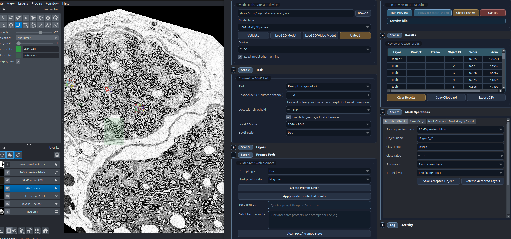

# napari-sam3-assistant

[](https://doi.org/10.5281/zenodo.20367206)



Latest version: `4.3.10`

`napari-sam3-assistant` is a napari plugin for local Segment Anything Model 3
(SAM3) segmentation. It provides:

- a guided `Simple` mode for common segmentation work;
- an `Advanced` mode for model setup, batch runs, local ROI inference, result
  tables, and 3D/video-style propagation;
- a separate `SAM3 Mask Operations` widget for cleanup, relabeling, isolation,
  merge, overlap inspection, and export.

The plugin is intended for researchers who want SAM3 results back in napari as
normal `Labels`, `Shapes`, and table-style outputs that can be reviewed,
corrected, saved, and exported.

## What It Does

- Segment 2D images with point, box/Shapes, labels-mask, text, or exemplar
  prompts.
- Search for similar features with exemplar prompting from a drawn region or
  crop image.
- Correct previews with Live Points using positive and negative clicks.
- Run local ROI inference on large TIFF or OME-Zarr-style images.
- In Advanced mode, run Phase 1 Huge Volume exemplar scans by processing 3D stacks slice by slice and writing tiled masks directly to OME-Zarr.
- Scan large 2D images tile by tile from an exemplar ROI and stitch the result
  into full-size labels.
- Propagate prompts through 3D stacks or video-like data when the installed SAM3
  backend supports the workflow.
- Save previews, clean connected components, relabel values, isolate overlapping
  candidates, merge labels/layers, inspect overlap, and export final masks.
- In Mask Operations, edit bounded regions with `Mask Cleanup / Multiclass` and save the current working region back to OME-Zarr or out to TIFF.

## Documentation

Start here:

1. [Installation](docs/installation.md)
2. [Model setup](docs/model_setup.md)
3. [User guide](docs/user_guide.md)
4. [Mask operations](docs/mask_operations.md)
5. [Troubleshooting](docs/troubleshooting.md)
6. [Huge Volume Mode](docs/huge_volume_mode.md)

Specialized setup:

- [CPU-only SAM3.0 setup](docs/cpu_only.md)
- [Windows SAM3.1 workaround](windows_sam31_workaround/README.md)

Maintainer notes:

- [Documentation strategy](docs/documentation_strategy.md)
- [Changelog](CHANGELOG.md)

## Quick Start

1. Install napari, PyTorch, the SAM3 backend, and this plugin.
2. Download the SAM3 model files from Meta's gated Hugging Face repositories.
3. Launch napari.
4. Open `Plugins > SAM3 Assistant`.
5. Choose a model folder.
6. In `Simple` mode, select an image, choose a task tab, add a prompt, and click
   `Run`, `Run Current ROI`, or `Start 3D`.
7. Use `Mask Ops` or `Plugins > SAM3 Mask Operations` when the preview needs
   cleanup, merge, or export.

For full setup commands, see [Installation](docs/installation.md).

## Requirements

- Python `>=3.11`
- napari `>=0.5`
- SAM3 Python package importable as `sam3`
- CUDA-enabled PyTorch and torchvision for normal use
- Local SAM3 model directory containing:
  - `config.json`
  - `processor_config.json`
  - a weight file such as `sam3.pt`, `model.safetensors`, or
    `sam3.1_multiplex.pt`

CPU-only use is experimental and limited to SAM3.0 2D image workflows with a
CPU-safe SAM3 backend. See [CPU-only SAM3.0 setup](docs/cpu_only.md).

## Model Files

SAM3 is not bundled with this plugin. Install the SAM3 backend separately and
download model files from Meta's gated Hugging Face repositories:

- https://huggingface.co/facebook/sam3
- https://huggingface.co/facebook/sam3.1

Example SAM3.0 folder:

```text
D:\models\sam3\
  config.json
  processor_config.json
  sam3.pt
```

Example SAM3.1 folder:

```text
D:\models\sam3_1\
  config.json
  processor_config.json
  sam3.1_multiplex.pt
```

Current model support:

- SAM3.0 weights: 2D image tasks and 3D/video propagation
- SAM3.1 `sam3.1_multiplex.pt`: 3D/video propagation through the SAM3.1
  multiplex video predictor
- SAM3.1 is not currently routed through the plugin's 2D image model loader

See [Model setup](docs/model_setup.md) for validation and device details.

## Prompt Guidance

For microscopy and other research images, the most useful prompts are usually
visual examples and local corrections, not text descriptions.

Recommended starting order:

1. `Exemplar` with a box or Shapes region for feature search.
2. `Live Points` with positive and negative points for local correction and
   repeatable object-by-object segmentation.
3. `3D Multiplex` with a box or Shapes region for propagating one selected
   object through slices or frames.
4. `2D Slice` with point or box prompts for quick single-plane local masks.

Text prompting is available, but it is least reliable for specialized
microscopy/anatomy terms. Labels-mask prompts are also available, but they are
best treated as an advanced option when you already have a useful rough mask.

Shapes prompts are treated as bounding boxes by the current SAM3 prompt path.
Rectangles are the clearest choice. Polygons can mark a region, but SAM3
receives the polygon's bounding rectangle, not the exact polygon contour.

See [User guide](docs/user_guide.md) for detailed examples.

## Workflow Highlights

Fast local segmentation loop:

1. Use `Exemplar`, `2D Slice`, or a box/Shapes prompt to create a preview.
2. Switch to `Live Points` when the preview is close.
3. Add positive points on missed parts and negative points on leakage.
4. Use the Live Points right-click menu to `Accept + Clear`. This menu is available in both Simple mode and Advanced mode while Live Points is active.
5. Click `Save Labels` or `Save & Clean`.
6. Move to the next object or ROI and repeat.

Large-image ROI loop:

1. Enable local/tiled inference and choose a tile/ROI size.
2. Draw or select a prompt box/point.
3. Click `Run Current ROI Only` to test that local region.
4. Changing ROI size recomputes the next local region; previous active ROIs are reused only when the requested size still matches.

Exemplar scan loop:

1. Draw a tight exemplar region around a representative object.
2. Run the current ROI first.
3. If the ROI result is good, scan the full image by tiles.
4. Review `SAM3 tiled exemplar labels` and `SAM3 tiled exemplar boxes`.
5. Use `SAM3 Mask Operations` for cleanup, isolation, merge, and export.

Tiled exemplar scans are a search workflow, not an exact repeat of `Run Current ROI Only`. The current tiled scan uses one exemplar crop as a visual reference for each tile by composing an exemplar-plus-tile image, then writes the tile-side result back to the full canvas. Multiple boxes in the current ROI can help `Run Current ROI Only` when they overlap that ROI, but tiled scan currently uses the first collected exemplar crop as the default reference for all tiles.

Huge Volume Phase 1 is available in Advanced Exemplar mode for 3D stacks. Enable `Enable large-image local inference`, check `Scan all Z slices to OME-Zarr`, then use `Scan Z Stack by Tiles`. This path writes tile labels directly to an OME-Zarr mask store and does not create a full in-memory volume. To curate the result, drag/open the mask as a Labels layer, use `Mask Operations > Mask Cleanup / Multiclass` with `Current slice` or a small `Z range` plus `Manual ROI`/`Drawn ROI`, then use `Region Output` to write the current working region back to the loaded OME-Zarr store/array or export it as TIFF. Region Output reports OME-Zarr shape/chunks/axes/dtype and requires an explicit override before writing to a different store. Mask Cleanup blocks unsafe huge-volume choices such as `Whole volume` and unbounded `Full mask`. Seam merging, cross-Z object linking, and resumable jobs are planned later phases.

Advanced mode also includes `Detection threshold`, with default `0.35`. Lower
values accept weaker candidates and may add false positives. Higher values are
stricter and may miss faint or uncommon structures. The Results table `Score`
is backend confidence when available; it is a review aid, not a scientific
quality measurement.

## Output Layers

Common preview layers:

```text
SAM3 preview labels
SAM3 preview masks
SAM3 preview boxes
SAM3 propagated preview labels
SAM3 tiled exemplar labels
SAM3 tiled exemplar masks
SAM3 tiled exemplar boxes
```

Common saved or curated layers:

```text
SAM3 saved labels
SAM3 saved propagated labels
SAM3 saved tiled exemplar labels
isolated_objects
merged_class_mask
final_training_mask
```

## Current Status

This project is young and under active development. The core inference workflow
is stable: collect prompts in napari, run SAM3 locally, write previews back to
napari, and help users save masks. Mask Operations is useful but still evolving.
The UI may continue to change, so the documentation is organized around user
tasks rather than exact layout alone.

## Development

Install in editable mode:

```bash
pip install -e .
```

Run tests:

```bash
PYTHONPATH=src pytest -q
```

The test suite covers coordinate mapping, prompt collection, adapter utility
behavior, mask operation services, and static widget UI checks. It does not
download SAM3 weights.

## Citation

If you use `napari-sam3-assistant` in your work, please cite the Zenodo archive for version `4.3.10`:

Teo, Wulin. (2026). `napari-sam3-assistant` (Version 4.3.10) [Computer software]. Zenodo. https://doi.org/10.5281/zenodo.20367206

```bibtex
@software{teo_2026_napari_sam3_assistant,
  author = {Teo, Wulin},
  title = {napari-sam3-assistant},
  version = {4.3.10},
  year = {2026},
  publisher = {Zenodo},
  doi = {10.5281/zenodo.20367206},
  url = {https://doi.org/10.5281/zenodo.20367206}
}
```

## References

- SAM3 repository: https://github.com/facebookresearch/sam3
- SAM3 model files: https://huggingface.co/facebook/sam3
- PyTorch installation selector: https://pytorch.org/get-started/locally/

## Acknowledgement

The demo image was provided by the Electron Microscopy Core Facility at Houston
Methodist Research Institute.

## License

MIT. See the project license file.
