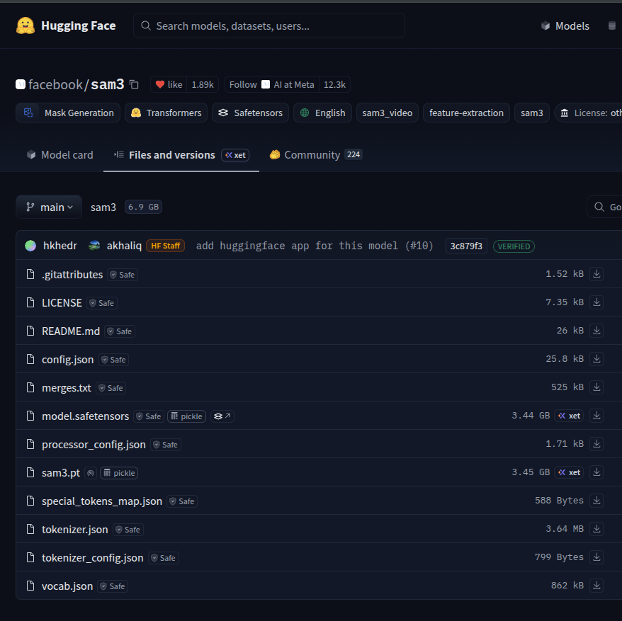

# napari-sam3-assistant


`napari-sam3-assistant` is a napari plugin for Segment Anything Model 3
(SAM3) segmentation. It provides a guided `Simple` mode for common image
segmentation work, an `Advanced` mode for detailed setup and batch runs, and a
separate `Mask Operations` widget for cleanup, merge, and export workflows.

The plugin is intended for researchers who want SAM3 results back in napari as
normal `Labels`, `Shapes`, and table-style outputs that can be reviewed,
cleaned, merged, and exported.

## What It Does

- Segment 2D images with points, boxes, text, labels-mask prompts, or exemplar
  boxes.
- Propagate prompts through 3D stacks or video-like data when the installed SAM3
  backend supports the workflow.
- Run local ROI inference on large TIFF or OME-Zarr-style images without sending
  the full plane to SAM3 at once.
- Scan large 2D images tile by tile from an exemplar ROI and stitch the result
  back into a full-size labels layer.
- Use Live Points with positive and negative corrections.
- Save previews, clean connected components, relabel values, isolate overlapping
  candidates, merge labels or layers, inspect overlap, and export final masks.

## Documentation

- [Documentation home](docs/index.md)
- [Installation](docs/installation.md)
- [Model setup](docs/model_setup.md)
- [User guide](docs/user_guide.md), including prompt selection and local
  segmentation workflows
- [Mask operations](docs/mask_operations.md)
- [Troubleshooting](docs/troubleshooting.md)
- [CPU-only SAM3.0 setup](docs/cpu_only.md)

Release notes and bug-fix history are maintained in [CHANGELOG.md](CHANGELOG.md).

## Quick Start

1. Install napari, PyTorch, the SAM3 backend, and this plugin.
2. Download the SAM3 model files from Meta's gated Hugging Face repositories.
3. Launch napari.
4. Open `Plugins > SAM3 Assistant`.
5. Choose a model folder.
6. In `Simple` mode, select an image, choose a task tab, add a prompt, and click
   `Run`, `Run Current ROI`, or `Start 3D`.
7. Use `Mask Ops` or `Plugins > SAM3 Mask Operations` when the preview needs
   cleanup, merge, or export.

For complete setup instructions, see [docs/installation.md](docs/installation.md).

## Requirements

- Python `>=3.11`
- napari `>=0.5`
- SAM3 Python package importable as `sam3`
- CUDA-enabled PyTorch and torchvision for normal use
- Local SAM3 model directory containing:
  - `config.json`
  - `processor_config.json`
  - a weight file such as `sam3.pt`, `model.safetensors`, or
    `sam3.1_multiplex.pt`

CPU-only use is experimental and limited to SAM3.0 2D image workflows with a
CPU-safe SAM3 backend. See [docs/cpu_only.md](docs/cpu_only.md).

## Current Status

This project is young and under active development. The core inference workflow
is stable:
collect prompts in napari, run SAM3 locally, write previews back to napari, and
help users save masks. Mask Operations is useful but still evolving. The UI may
continue to change as the workflow gets simpler, so the documentation is
organized around user tasks rather than exact screen layout alone.

## Extended Notes

The sections below keep detailed setup and workflow notes for users who are
already relying on this README. The focused documentation pages above are the
preferred entry points for new users.

## Setup

### Windows

1. Download and install **Miniforge**:  
   https://github.com/conda-forge/miniforge/releases/latest/download/Miniforge3-Windows-x86_64.exe

2. After Miniforge is installed, open either:
   - **Miniforge Prompt**
   - **PowerShell**

3. Create and activate the environment
```Bash
conda create -n napari-sam3 python=3.11 -y
conda activate napari-sam3
```
4. Install base Python tools and napari
```Bash
python -m pip install --upgrade pip wheel
python -m pip install "setuptools<82"
python -m pip install "napari[all]"
```
5. Install CUDA-enabled PyTorch

```Bash
python -m pip install torch torchvision torchaudio --index-url https://download.pytorch.org/whl/cu128
```
6. Install SAM3

Choose one:

Option A. Install from a local clone
```bash
git clone https://github.com/facebookresearch/sam3.git
cd sam3
python -m pip install --no-cache-dir -e .
```
Option B. Install directly from GitHub
```Bash
python -m pip install --no-cache-dir git+https://github.com/facebookresearch/sam3
```
7. Install extra dependencies
```Bash
python -m pip install einops triton-windows pycocotools
```
If `SAM3.1` multiplex propagation later fails on Windows with errors such as
`No available kernel. Aborting execution!`, see the replacement-file workaround in
[`windows_sam31_workaround/README.md`](windows_sam31_workaround/README.md).

8. Install napari-sam3-assistant
```Bash
python -m pip install napari-sam3-assistant
```
If you are installing from a local repository checkout instead:
```Bash
python -m pip install -e .
```
9. Launch napari
```
napari
```

### Linux ARM64 (AArch64)
1. Download Miniforge
https://conda-forge.org/download/

Install Miniforge first.
```Bash
chmod +x Miniforge3-Linux-aarch64.sh
./Miniforge3-Linux-aarch64.sh -b -p "$HOME/miniforge3"
source "$HOME/miniforge3/bin/activate"
```
2. Create and activate the environment
```Bash
conda create -n napari-sam3 python=3.11 -y
conda activate napari-sam3
```
3. Install base Python tools and napari
```Bash
python -m pip install --upgrade pip wheel
python -m pip install "setuptools<82" "numpy>=1.26,<2"
python -m pip install "napari[bermuda, pyqt6, optional-numba, optional-base]"
```

4. Install CUDA-enabled PyTorch

```Bash
python -m pip install torch torchvision torchaudio --index-url https://download.pytorch.org/whl/cu130
```
5. Install SAM3

```Bash
git clone https://github.com/facebookresearch/sam3.git
cd sam3
python -m pip install --no-cache-dir -e .
```
6. Install extra dependencies
```Bash
python -m pip install einops triton pycocotools
```
7. Install napari-sam3-assistant
```Bash
python -m pip install napari-sam3-assistant
```
If you are installing from a local repository checkout instead:
```Bash
python -m pip install -e .
```
8. Launch napari
```Bash
napari
```

Verify the installation

Inside the activated environment, confirm that SAM3 imports correctly:
```Bash
python -c "import sam3; print('sam3 import OK')"
```
You can also verify napari:
```Bash
python -c "import napari; print(napari.__version__)"
```

## Download SAM 3 model files

Download the model files from:

- `https://huggingface.co/facebook/sam3`
- `https://huggingface.co/facebook/sam3.1`

These repositories are gated, so you must request or accept access first.

After approval, download the files manually from the **Files and versions** tab.

A reference screenshot of the file list is shown below:



## Model folder

The model files can be stored in any folder you want.

Examples:

```text
D:\models\sam3
D:\models\sam3_1

```

The plugin only needs the correct folder path.

Example SAM3.0 folder:

```text
D:\models\sam3\
  config.json
  processor_config.json
  sam3.pt
```

`model.safetensors` is also supported as a SAM3 3.0 weight file.

Example SAM3.1 folder:

```text
D:\models\sam3_1\
  config.json
  processor_config.json
  sam3.1_multiplex.pt
```

Current model support:

- SAM3.0 weights: 2D image tasks and 3D/video propagation
- SAM3.1 `sam3.1_multiplex.pt`: 3D/video propagation through the SAM3.1 multiplex video predictor
- SAM3.1 is not currently routed through the plugin's 2D image model loader


## Device rule

- Use a CUDA-enabled PyTorch environment for normal use.
- Select **GPU / CUDA** for SAM3.0, SAM3.1, and 3D/video workflows.
- **CPU** is experimental for SAM3.0 2D image workflows with a CPU-safe SAM3 backend. Tested CPU workflows include points, boxes, exemplar, text, and Live Points. See [CPU-only SAM3.0 setup](docs/cpu_only.md).

## For developers

If you want editable installs and `git pull`, use:

```powershell
git clone https://github.com/facebookresearch/sam3.git
cd sam3
python -m pip install --no-cache-dir -e .

git clone https://github.com/wulinteousa2-hash/napari-sam3-assistant.git
cd napari-sam3-assistant
python -m pip install -e .
```

## Basic Workflow

### Simple Mode

Use `Simple` when you want a guided image-segmentation workflow with fewer controls on screen.

The main flow is:

1. Select an image and choose a task tab.
2. Add the prompt.
3. Click `Run`, `Run Current ROI`, or `Start 3D`, depending on the task.

Simple mode is intended for common imaging tasks:

- `Exemplar`: draw one box on the target image or use a crop image; local/tiled inference is available for large images.
- `Live Points`: use positive or negative point corrections.
- `3D Multiplex`: start SAM3.1 multiplex propagation from points or boxes on the selected frame or slice.
- `Cleanup`: open `SAM3 Mask Operations`.
- `2D Slice`: use points, boxes, or labels-mask prompts on the selected image plane.
- `Text`: enter a short imaging concept such as `cell`, `nucleus`, or `myelin`.

Simple mode keeps model setup small:

- model folder
- `GPU / CUDA` or experimental `CPU`
- SAM3.0 for Simple image tasks and SAM3.1 for the Simple `3D Multiplex` task

Use `Advanced` when you need SAM3.1 model selection, batch processing, large-image ROI controls, detailed result tables, or CSV export.

After a Simple preview creates labels, click `Mask Ops` in the Run area to open `SAM3 Mask Operations` on the cleanup tab.

### Advanced Mode

`Advanced` is the original full workflow. It keeps the Step 1 to Step 6 layout for users who want manual control.

1. Open an image in napari.
2. Open `Plugins > SAM3 Assistant`.
3. Choose `Advanced`.
4. Select the image in `Target image`.
5. Select a task.
6. Create a prompt layer if the task needs one.
7. Click `Run Preview`.
8. Inspect `SAM3 preview labels`, `SAM3 preview masks`, or `SAM3 preview boxes`.
9. Use `Save & Clean` in `Step 4. Run and Save` for quick mask acquisition, or open `SAM3 Mask Operations` if you want advanced cleanup, merge, or export controls.

Use `Clear Preview` to remove generated preview layers without deleting prompts or saved labels.

### Run and Save

`Step 4. Run and Save` includes a quick save path for users who want to acquire a mask and immediately continue segmentation.

After a preview is created, choose:

- output folder
- output format
- filename

Then click `Save & Clean`.

`Save & Clean`:

- saves the current preview mask as a new napari Labels layer
- writes the mask file to the selected output folder
- removes temporary preview layers
- releases Python / CUDA temporary memory where available
- unloads the SAM3 model so memory returns closer to baseline
- leaves an `Open Folder` shortcut for the saved mask location

If `Load model when running` is checked, the next run reloads the model automatically.

Supported quick-save formats:

| Preview type | TIFF | NumPy `.npy` | PNG |
| --- | --- | --- | --- |
| 2D mask | Yes | Yes | Yes |
| 3D/video propagated mask | Yes | Yes | No |

PNG is only offered for 2D masks. For 3D/video outputs, use TIFF stack or NumPy `.npy`.

### Large-Image Local Inference

Large-image mode is optional and off by default. When it is off, the plugin keeps the existing full-image inference path.

Use this mode for OME-Zarr, large TIFF, and similar large images where sending the full selected plane to SAM3 is too expensive.

Workflow:

1. Set up the normal task and prompt type.
2. Enable `Enable large-image local inference` in Advanced task setup.
3. Choose a local ROI size:

```text
512 x 512
1024 x 1024
2048 x 2048
4096 x 4096
8192 x 8192
```

4. Add a point or box prompt.
5. Click `Run Preview`, or add points in Live Points mode.

ROI behavior:

- Point prompts use the latest point as the ROI anchor.
- Box prompts use the box center and keep the box inside the local inference window when possible.
- Live Points use the latest point as the ROI anchor.
- Text-only prompts keep the full-image path in this first pass unless a point or box anchor is also available.
- If a new point or box stays inside the current ROI, the same ROI is reused.
- If a new point or box falls outside the current ROI, the ROI is rebuilt around the new prompt.

The active ROI is shown as:

```text
SAM3 active ROI
```

SAM3 receives only the local ROI image data. Returned labels and boxes are written back into global image coordinates in the normal preview layers.

Status messages report:

```text
Large-image mode OFF: full-image inference.
Large-image mode ON: local ROI inference (WIDTH x HEIGHT).
Active ROI bounds: y=Y0:Y1, x=X0:X1.
```

For large ROI work, `Save & Clean` is the recommended handoff after a successful preview. It saves the mask, clears temporary preview memory, unloads the model, and lets users continue with another ROI without manually visiting Mask Operations.

### Batch Multiple 2D Images

Use `Batch all image layers` when several open 2D images should receive the same prompt setup.

Workflow:

1. Open multiple images in napari.
2. Configure a 2D task such as text, box, exemplar, or labels-mask segmentation.
3. Add the prompt once.
4. Enable `Batch all image layers` in `Advanced`.
5. Click `Run Preview`.

Each source image gets its own output layers:

```text
SAM3 preview labels [image name]
SAM3 preview masks [image name]
SAM3 preview boxes [image name]
```

Batch preview layers can be reviewed directly or used in Mask Operations.

Batch mode is intended for 2D image tasks. It is disabled for Live Points and 3D/video propagation because those workflows depend on one active image/session.

### Multi-Text Batch Mode

Use `Batch text prompts` when you want each text concept to run independently instead of writing one combined phrase such as `cat and dog`.

Workflow:

1. Set `Task` to `Text segmentation`.
2. Enter one concept per line in `Batch text prompts`:

```text
cat
dog
person
```

3. Leave `Batch all image layers` off to run all prompts on the selected image only.
4. Enable `Batch all image layers` to run every prompt on every open image.
5. Click `Run Preview`.

Outputs include both image and prompt:

```text
SAM3 preview labels [Image 1 - cat]
SAM3 preview labels [Image 1 - dog]
SAM3 preview labels [Image 2 - cat]
SAM3 preview labels [Image 2 - dog]
```

The Results table includes a `Prompt` column. Object IDs are scoped to each image-prompt result, so `Object ID 1` for `Image 1 - cat` is separate from `Object ID 1` for `Image 1 - dog`.

## Tasks

### Text Segmentation

Use text to segment all matching instances of a concept.

Workflow:

1. Set `Task` to `Text segmentation`.
2. Leave `Prompt type` as `Text only`.
3. Enter a short phrase, for example:

```text
cell
nucleus
myelin
myelin sheath
```

4. Keep `Detection threshold` near the default `0.35`, or lower it if the result is empty.
5. Press `Enter` in the text prompt field or click `Run Preview`.

No prompt layer is needed for text segmentation. `Create Prompt Layer` is not required.

Text prompts usually work better as short noun phrases than instructions. Prefer `myelin sheath` over `segment all the myelin rings`. The plugin strips common instruction prefixes before sending the prompt to SAM3, but microscopy-specific language can still be difficult for the model.

If the result says `objects=0`, SAM3 ran but did not return masks above threshold. Try a shorter noun phrase, lower `Detection threshold`, or use a box/exemplar prompt for structures that are visually clear but not well recognized by text.

### 2D Segmentation With Boxes

Use boxes to segment the target region inside each drawn box.

Workflow:

1. Set `Task` to `2D segmentation`.
2. Set `Prompt type` to `Box`.
3. Click `Create Prompt Layer`.
4. Draw one or more rectangles in the `SAM3 boxes` Shapes layer.
5. Click `Run Preview`.

Each 2D box preview writes segmentation only inside the corresponding drawn box. This is different from `Exemplar segmentation`, which uses boxed examples to find and segment similar objects outside the original boxes.

### Exemplar Segmentation

Use example ROIs to segment similar objects.

Workflow:

1. Set `Task` to `Exemplar segmentation`.
2. Set `Prompt type` to `Box`.
3. Click `Create Prompt Layer`.
4. Draw boxes around one or more example objects.
5. Click `Run Preview`.

The local SAM 3 image API exposes visual exemplars through geometric box prompts. The plugin stores ROI metadata, but inference currently passes exemplar ROIs as SAM 3 visual box prompts.

`Exemplar segmentation` is a 2D/image task in this plugin. For exemplar-like 3D propagation, use `3D/video propagation` with a box prompt on the selected frame or slice.

### Live Points With Positive and Negative Points

Use points to correct a result.

Workflow:

1. Set `Task` to `Live Points`.
2. Set `Prompt type` to `Points (positive/negative)`.
3. Click `Create Prompt Layer`.
4. Choose `Positive` and add points on regions to include.
5. Choose `Negative` and add points on regions to exclude.
6. Click `Run Preview`.

This is useful after a text, box, or exemplar preview is close but not correct.

### Labels Mask Prompt

Use a napari Labels layer as a mask-style prompt.

Workflow:

1. Set a task that supports mask prompts.
2. Set `Prompt type` to `Labels mask`.
3. Click `Create Prompt Layer`.
4. Paint non-zero pixels in `SAM3 mask prompt`.
5. Click `Run Preview`.

Labels-mask prompts are currently supported for 2D/image workflows, not `3D/video propagation`. For 3D/video propagation, use text, box, or point prompts on the selected frame.

### 3D Stack / Video Propagation

Treat a stack as video-like data and propagate a prompt through frames or slices.

Workflow:

1. Open a stack in napari.
2. Set `Task` to `3D/video propagation`.
3. Select the target frame or slice in napari.
4. Create a prompt layer and add prompts on that frame.
5. Choose propagation direction:
   - `both`
   - `forward`
   - `backward`
6. Click `Start 3D Propagation`.

In `3D/video propagation` mode, the primary run button changes from `Run Preview` to `Start 3D Propagation`. This starts a new SAM3 video session, adds the current frame prompt, and propagates through the stack. `Propagate Existing Session` is an advanced action that reuses the current SAM3 video session without adding a new prompt; it is enabled only after a successful 3D propagation run.

3D/video prompt limits:

- SAM3.0 video propagation supports one initial visual box on the prompted frame.
- SAM3.1 video multiplex can accept multiple box prompts.
- Point prompts target one object per request and cannot be mixed with text or box prompts in the same 3D/video request.
- Point prompts are limited to 16 points per request. SAM3's tracker prompt encoder uses the first 8 and last 8 points when more are supplied, so the plugin fails early instead of letting middle points be ignored.
- Labels-mask prompts are not supported by the SAM3 video predictor API used by this plugin.
- `Exemplar segmentation` itself is routed through the 2D image model. Use box prompts in `3D/video propagation` when the goal is exemplar-like propagation through a stack.

Preview output is written to:

```text
SAM3 propagated preview labels
```

Saved output is written to:

```text
SAM3 saved propagated labels
```

The current SAM 3 video predictor backend is CUDA-only. CPU mode is experimental for SAM3.0 2D image workflows with a CPU-safe SAM3 backend; see [CPU-only SAM3.0 setup](docs/cpu_only.md).

## Channel Axis

`Channel axis` tells the plugin which data axis is color/channel.

Default:

```text
-1
```

Use `-1` for grayscale images and normal RGB/RGBA images. The plugin auto-detects trailing RGB/RGBA axes of size `3` or `4`.

Examples:

```text
(H, W)          -> -1
(H, W, 3)      -> -1
(H, W, 4)      -> -1
(Z, H, W)      -> -1
(C, H, W)      -> 0
(Z, C, H, W)   -> 1
(T, C, H, W)   -> 1
(Z, H, W, C)   -> 3
```

Leave it at `-1` unless your image has an explicit multi-channel microscopy dimension.

## Output Layers

Preview layers:

```text
SAM3 preview labels
SAM3 preview masks
SAM3 preview boxes
SAM3 propagated preview labels
```

Saved layers:

```text
SAM3 saved labels
SAM3 saved propagated labels
SAM3 saved tiled exemplar labels
```

Buttons:

- `Validate`: check the selected SAM 3 model directory.
- `Load 2D Model`: load the 2D/image model.
- `Load 3D/Video Model`: load the video propagation model.
- `Run Preview`: run the selected task.
- `Clear Preview`: remove generated preview layers only.
- `Cancel`: stop a running worker.
- `Unload`: unload the SAM3 model from memory.
- `Save & Clean`: save the current preview labels, export a mask file, clear
  temporary preview layers, and release temporary model memory where possible.

Results table:

```text
Layer | Prompt | Frame | Object ID | Score | Area
```

- `Layer`: source image layer.
- `Prompt`: text prompt used for text and multi-text results. For non-text workflows this is `-`.
- `Frame`: propagated frame or slice index. For 2D results this is `-`.
- `Object ID`: SAM3 object ID when available, otherwise a generated label ID.
- `Score`: SAM3 confidence/probability when returned by the backend.
- `Area`: number of mask pixels for that object in the displayed 2D plane or frame.

Results actions:

- `Clear Results`: clear the table only.
- `Copy Clipboard`: copy tab-separated results, including headers, for pasting into Excel or statistics software.
- `Export CSV`: save the results table to a CSV file.

## Tested Image Coverage

The following image sizes and channel layouts have been exercised with the current workflow:

| Image type | Size / layout | Workflow | Status |
| --- | --- | --- | --- |
| Single-channel 2D | about `2048 x 2048` | 2D preview and quick save | Passed |
| RGB 2D | about `2048 x 2048 x 3` | 2D preview and quick save | Passed |
| Single-channel large image | about `60000 x 60000` | large-image local ROI inference with quick save and clean | Passed |
| RGB large image | about `60000 x 60000 x 3` | large-image local ROI inference | Not yet tested |

Large-image coverage means the plugin was used with local ROI inference rather than sending the full image plane to SAM3 at once. Actual memory use depends on ROI size, model type, device, source image backend, and whether napari already holds large arrays in memory.

Label-value merge:

Use this when multiple SAM3 objects should become the same class value in a Labels layer. For example, if labels `3`, `4`, `5`, and `6` are all the same biological class, set:

```text
Values to replace: 3,4,5,6
New value: 3
```

Then click `Apply Relabel`. The selected Labels layer is updated in place.

## Mask Operations

`SAM3 Mask Operations` is a separate napari widget for turning SAM3 previews into curated masks for analysis or training data. Open it from the plugin menu or from the `Mask Ops` button in Simple mode. When opened from `Mask Ops`, it starts as a floating tool window.

Tabs:

- `Mask Cleanup / Multiclass`: clean one Labels layer, remove small objects, relabel values, delete components, fill holes, smooth masks, keep the largest component, and handle multiclass cleanup.
- `Mask Isolation`: compare many aligned SAM3 mask layers and create one clean isolated object layer.
- `Merge Layers`: combine selected Labels layers into one class or instance mask.
- `Final Merge / Export`: merge cleaned class masks into semantic, instance, or binary final masks, choose overlap handling, and export TIFF, PNG, or NumPy `.npy` files.

The mask operations panel works on napari Labels layers, including SAM3 preview and saved label layers.

Mouse-assisted cleanup:

- In `Mask Cleanup / Multiclass`, open `Local Edit`.
- Enable `Enable canvas right-click delete tools`.
- Right-click a label object in the selected target Labels layer to open delete actions.
- Enable `Enable canvas assign tools` when you want right-click assignment to the current `Assignment value`.
- Click `Undo Last Edit` to restore the previous mask state for the selected Labels layer.
- Double-click a component table row to jump the viewer to that mask component.
- This is useful for supervised cleanup after SAM3 creates a preview mask.

Overlap inspection:

- In `Final Merge / Export`, select two or more class mask layers.
- Click `Show Overlap Map`.
- The plugin creates `SAM3 overlap map`, where non-zero pixels mark locations covered by more than one selected class mask.

## ARM64, CUDA, and DGX Spark

For ARM64 systems such as NVIDIA DGX Spark / GB10:

- Use Python 3.11 or newer.
- Keep the NVIDIA driver and CUDA stack current.
- Install a PyTorch/torchvision build that supports your GPU architecture.
- Use a PyTorch/torchvision/SAM3 build with CUDA kernels compatible with the device.
- CPU-only PyTorch requires a CPU-safe SAM3 backend for image workflows; see [CPU-only SAM3.0 setup](docs/cpu_only.md).

Check PyTorch GPU support:

```bash
python - <<'PY'
import torch
print("torch:", torch.__version__)
print("torch cuda runtime:", torch.version.cuda)
print("cuda available:", torch.cuda.is_available())
if torch.cuda.is_available():
    print("device:", torch.cuda.get_device_name(0))
    print("capability:", torch.cuda.get_device_capability(0))
    print("arch list:", torch.cuda.get_arch_list())
PY
```

GB10 reports compute capability `12.1` (`sm_121`). If your PyTorch build does not include compatible kernels, you may see:

```text
CUDA error: no kernel image is available for execution on the device
nvrtc: error: invalid value for --gpu-architecture
```

The plugin does not compile PyTorch, torchvision, or SAM 3 CUDA extensions.

## Troubleshooting

### No mask appears and status says `objects=0`

SAM 3 returned no detections above threshold. Try:

- a shorter text prompt
- a more common concept phrase
- a lower `Detection threshold`
- box or exemplar prompts
- a CUDA/PyTorch/SAM3 build compatible with your GPU

### CUDA kernel image error

Error:

```text
CUDA error: no kernel image is available for execution on the device
```

The GPU is visible, but at least one required CUDA kernel was not built for the device architecture. Install compatible PyTorch/torchvision/SAM 3 builds for the GPU. For CPU-only 2D use, see [CPU-only SAM3.0 setup](docs/cpu_only.md).

### Invalid GPU architecture

Error:

```text
nvrtc: error: invalid value for --gpu-architecture
```

The installed PyTorch CUDA runtime cannot compile for the detected GPU. Install a PyTorch/torchvision/SAM 3 build that supports the GPU. For CPU-only 2D use, see [CPU-only SAM3.0 setup](docs/cpu_only.md).

### BFloat16 conversion errors

The plugin converts SAM3 `bfloat16` outputs to `float32` before writing NumPy-backed napari layers. If you still see dtype errors, restart napari after changing device mode and run again.

### SAM3.1 `start_session` fails with `unexpected keyword argument 'offload_state_to_cpu'`

This is a plugin/backend API mismatch, not a prompt or data problem.

- The failure happens during `start_session` / `init_state`, before propagation actually begins.
- The installed `sam3` backend does not accept the keyword that newer plugin code may pass.
- The plugin includes compatibility handling for this case so older installed `sam3` backends can still start a 3D/video session.

If you still see this exact error, first verify that napari is importing the intended local `sam3` install and not an older duplicate environment copy.

### SAM3.1 propagation fails later with `No available kernel. Aborting execution!` on Windows

This is a different issue from the `offload_state_to_cpu` startup mismatch.

- `start_session` succeeds.
- prompts are accepted.
- the failure happens only when `SAM3.1` multiplex propagation actually starts.

On some Windows systems using `triton-windows`, this appears to be an upstream `sam3` runtime/kernel path issue rather than a napari prompt-collection bug.

Use the documented Windows workaround here:

- [`windows_sam31_workaround/README.md`](windows_sam31_workaround/README.md)

### Text prompt creates no layer

That is expected. Text segmentation does not need a prompt layer. Enter text and click `Run Preview`.

## Development

Install in editable mode:

```bash
pip install -e .
```

Run tests:

```bash
PYTHONPATH=src pytest -q
```

The test suite covers coordinate mapping, prompt collection, adapter utility behavior, and static widget UI checks. It does not download SAM 3 weights.

## References

- SAM 3 repository: https://github.com/facebookresearch/sam3
- SAM 3 model files: https://huggingface.co/facebook/sam3
- PyTorch installation selector: https://pytorch.org/get-started/locally/

## Acknowledgement
The demo image was provided by the Electron Microscopy Core Facility at Houston Methodist Research Institute

## License

MIT. See the project license file.
