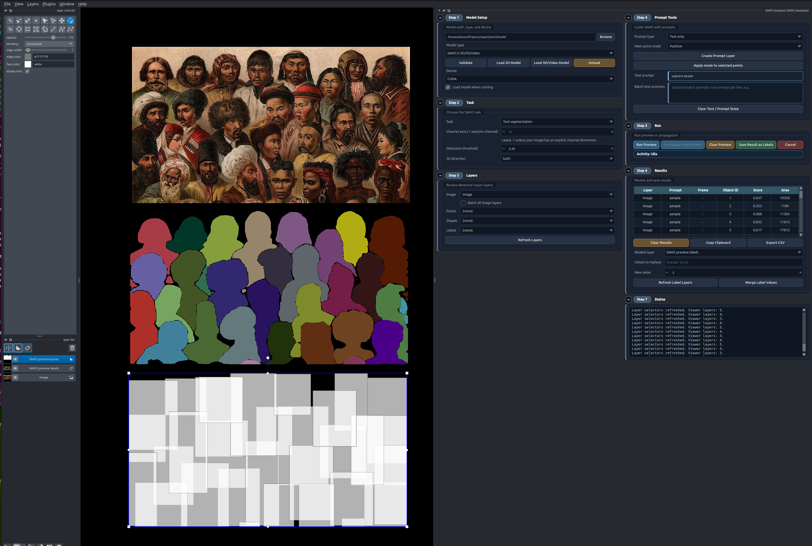
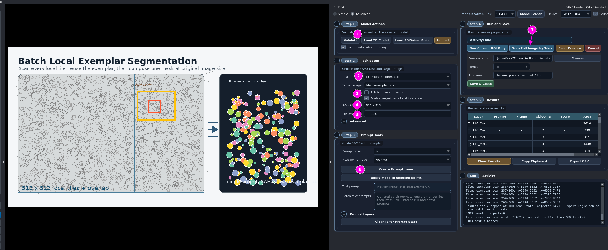

# User Guide

Open the main widget from:

```text
Plugins > SAM3 Assistant
```

Use `Simple` first unless you specifically need advanced setup, batch work,
large-image ROI controls, detailed result tables, or SAM3.1 video-model
selection.

## Simple Mode

Simple mode is the shortest path from image to preview. It starts on task tabs
instead of exposing every backend option at once.

1. Open an image or stack in napari.
2. Open `Plugins > SAM3 Assistant`.
3. Choose `Simple`.
4. Select the target image.
5. Choose a task tab.
6. Add the prompt.
7. Click `Run`, `Run Current ROI`, or `Start 3D`, depending on the task.
8. Review the generated napari layer.
9. Click `Mask Ops` when the result needs cleanup, merge, or export.

Simple task tabs:

| Task | Use it for | Prompt |
| --- | --- | --- |
| `Exemplar` | Find objects similar to boxed examples | target box or crop image |
| `Live Points` | Interactive positive/negative corrections | points |
| `3D Multiplex` | Propagate from the selected frame or slice | points or boxes |
| `Cleanup` | Open mask cleanup, merge, and export tools | existing labels layer |
| `2D Slice` | General 2D image segmentation on the selected image or current slice | points, box, or labels |
| `Text` | Try broad/common visual concepts | short text phrase |

Text prompts usually work better as short noun phrases than instructions. They
are most useful for common visual concepts and less reliable for specialized
scientific anatomy or microscopy features. If `axon`, `myelin`, or another
domain term returns poor results, use a box, point, exemplar, or labels-mask
prompt instead.

Live Points shortcuts:

```text
T        change the next point mode
Shift+T  flip the selected or latest point and rerun
```

Live Points also has a right-click preview menu with `Accept + Clear`, `Accept
Only`, `Clear Prompt`, and `Undo Last Accept`.

## Prompt Types: Which One To Use

For microscopy and other research images, the most useful prompts are usually
visual examples and local corrections, not text descriptions. Use this order as
a practical starting point.

| Rank | Prompt workflow | Best use | Notes |
| --- | --- | --- | --- |
| 1 | `Exemplar` with a box or Shapes region | Feature search: find objects similar to one good example | Recommended first for research features. Draw a representative object, test the local ROI, then scan or repeat |
| 2 | `Live Points` with positive and negative points | Local correction and repeated object-by-object segmentation | Fast for fixing missed parts and removing leakage. Use `Accept + Clear`, save, then move to the next object or ROI |
| 3 | `3D Multiplex` with a box or Shapes region | Propagating a selected object through slices or frames | Use when one prompt frame should guide segmentation across a stack/video |
| 4 | `2D Slice` with point or box prompts | Single-object local segmentation on one plane | Useful for quick local masks, but usually less efficient than exemplar when searching for many similar features |

Secondary prompt options:

- `Text` is least reliable for specialized microscopy/anatomy terms. It can be
  useful for broad common visual concepts, but for research features it is often
  less specific than exemplar, box, or point prompts.
- `Labels mask` prompts are available for 2D workflows, but they can be
  cumbersome for discovery because the user must already paint a useful mask.
  Treat them as an advanced option when you already have a rough prior mask.
- Crop-image exemplar is useful when the example object is already isolated in a
  small separate image layer.

Shapes-layer prompts are treated as bounding boxes by the current SAM3 prompt
path. Rectangles are the clearest choice. Polygons can be used to mark a region,
but SAM3 receives the polygon's bounding rectangle, not the exact polygon
contour. Use a `Labels mask` prompt only when the exact painted shape matters.

## Powerful Local Workflows

### Quick Prompt, Live Point, Save, Repeat

For local segmentation, the fastest productive loop is often:

1. Use `Exemplar`, `2D Slice`, or a box/Shapes prompt to create a preview.
2. Switch to `Live Points` when the preview is close.
3. Add positive points on missing object parts.
4. Add negative points on leakage or neighboring objects.
5. Use the Live Points right-click menu to `Accept + Clear`.
6. Click `Save Labels` or `Save & Clean`.
7. Move to the next object or ROI and repeat.

This is useful when you want high-quality local masks without building a large
batch workflow first. Positive and negative points are especially strong for
small corrections because you can keep the user decision local and visible.

### Exemplar, Test ROI, Then Scan

Exemplar prompting is powerful when one good example should find many similar
objects.

1. Draw a tight exemplar box around a representative object.
2. Run the current ROI first.
3. If the ROI result is good, use tiled scanning for the full image.
4. Use `Mask Operations` to clean, merge, or isolate final masks.

A good exemplar should include the full object with a little context, but not a
large amount of background or neighboring objects. For large images, testing the
ROI first saves time and prevents scanning the full plane with a poor example.

## Advanced Mode

Advanced mode exposes the full Step 1 to Step 6 workflow.

1. Open an image in napari.
2. Open `Plugins > SAM3 Assistant`.
3. Choose `Advanced`.
4. Select the target image.
5. Select the SAM3 model type and model folder.
6. Select a task and prompt type.
7. Create a prompt layer if the task needs one.
8. Add prompts in napari.
9. Click `Run Preview` or `Start 3D Propagation`.
10. Inspect the preview layers and results table.
11. Use quick save or open `SAM3 Mask Operations` for curation.

Important buttons:

| Button | Meaning |
| --- | --- |
| `Validate` | Check the selected SAM3 model directory |
| `Load 2D Model` | Load the SAM3 image model |
| `Load 3D/Video Model` | Load the video propagation model |
| `Run Preview` | Run the selected 2D task |
| `Start 3D Propagation` | Start a video-like propagation session |
| `Propagate Existing Session` | Reuse the current video session after a successful run |
| `Clear Preview` | Remove generated preview layers only |
| `Cancel` | Stop a running worker |
| `Unload` | Unload the SAM3 model from memory |

The top strip shared by both modes stores the selected model folder. Advanced
mode also exposes model type, device, validation, and load/unload controls.

## 2D Segmentation With Boxes

Use boxes when you want SAM3 to segment the object inside each drawn rectangle.

1. Set `Task` to `2D segmentation`.
2. Set `Prompt type` to `Box`.
3. Click `Create Prompt Layer`.
4. Draw one or more rectangles in the `SAM3 boxes` Shapes layer.
5. Click `Run Preview`.

This differs from exemplar segmentation. Box segmentation targets the boxed
region itself; exemplar segmentation uses boxed examples to find similar objects.

## Text Segmentation

Use text when the target is a broad/common visual concept likely to be known by
the model. For microscopy feature search, prefer exemplar, point, box, or
Shapes-region prompts.

1. Set `Task` to `Text segmentation`.
2. Enter a short prompt.
3. Keep `Detection threshold` near the default `0.35`, or lower it if no object
   is returned.
4. Press `Enter` or click `Run Preview`.

No prompt layer is needed for text-only segmentation.

If the status says `objects=0`, SAM3 ran but did not return masks above the
threshold. Try a shorter phrase, lower the threshold, or use exemplar, point, or
box prompts.



## Exemplar Segmentation

Use exemplar segmentation when one or more example boxes should guide SAM3
toward similar objects.

1. Set `Task` to `Exemplar segmentation`.
2. Set `Prompt type` to `Box`.
3. Click `Create Prompt Layer`.
4. Draw boxes around example objects.
5. Click `Run Preview`.

For large images, test one local ROI first. If it works, use the tiled scan
workflow described below.

In Simple mode, the `Exemplar` tab can also use `Use crop image`. Select a crop
image and crop region when the exemplar is already available as a small image
layer instead of a box drawn on the target.

## Large-Image Local Inference

Large-image local inference is optional and off by default. It is useful for
OME-Zarr, large TIFF, and other data where full-plane inference is too expensive.

1. Set up a normal 2D task.
2. Enable `Enable large-image local inference` in Advanced mode.
3. Choose a local ROI size such as `1024 x 1024` or `2048 x 2048`.
4. Add a point or box prompt.
5. Click `Run Preview`.

ROI behavior:

- Point prompts use the latest point as the ROI anchor.
- Box prompts use the box center and keep the box inside the local window when
  possible.
- Live Points use the latest point as the ROI anchor.
- If a new point or box remains inside the active ROI, the same ROI is reused.
- If a new point or box falls outside the active ROI, the ROI is rebuilt around
  the new prompt.

The active ROI appears as:

```text
SAM3 active ROI
```

SAM3 receives only the local ROI image data. The returned masks and boxes are
written back into global image coordinates.

## Tiled Exemplar Scan

Use `Scan Full Image by Tiles` when an exemplar ROI works locally and you want
to scan the whole 2D image.

1. Set `Task` to `Exemplar segmentation`.
2. Enable large-image local inference.
3. Choose a local ROI size. This becomes the tile size.
4. Draw one exemplar box.
5. Use `Run Current ROI Only` in Advanced mode, or `Run Current ROI` in Simple
   mode, to test the example tile.
6. If the preview is acceptable, click `Scan Full Image by Tiles` in Advanced
   mode, or `Scan Full Image` in Simple mode.

Useful controls:

- `Tile overlap`: default `15%`, helps reduce missed objects near tile edges.
- `Merge seam-split objects`: enabled by default, reconnects objects cut by tile
  boundaries after stitching.

The stitched full-image result is written to:

```text
SAM3 tiled exemplar labels
SAM3 tiled exemplar masks
SAM3 tiled exemplar boxes
```



## Batch 2D Images

Use `Batch all image layers` when several open 2D images should receive the same
prompt setup.

1. Open multiple images in napari.
2. Configure a 2D task such as text, box, exemplar, or labels-mask segmentation.
3. Add the prompt once.
4. Enable `Batch all image layers` in Advanced mode.
5. Click `Run Preview`.

Each source image receives its own output layers:

```text
SAM3 preview labels [image name]
SAM3 preview masks [image name]
SAM3 preview boxes [image name]
```

Batch mode is intended for 2D image tasks. It is disabled for Live Points and
3D/video propagation.

## Batch Text Prompts

Use `Batch text prompts` when each concept should run independently.

1. Set `Task` to `Text segmentation`.
2. Enter one concept per line:

```text
cell
person
cat
```

3. Leave `Batch all image layers` off to run all prompts on the selected image.
4. Enable `Batch all image layers` to run every prompt on every open image.
5. Click `Run Preview`.

Output layer names include both image and prompt:

```text
SAM3 preview labels [Image 1 - cell]
SAM3 preview labels [Image 1 - person]
SAM3 preview labels [Image 2 - cat]
```

## 3D Stack / Video Propagation

Use 3D/video propagation to treat a stack as video-like data.

1. Open a stack in napari.
2. Set `Task` to `3D/video propagation`.
3. Select the target frame or slice.
4. Create a prompt layer.
5. Add points or boxes on the selected frame. In Advanced mode, text prompts
   may also be used when supported by the installed SAM3 backend.
6. Choose propagation direction: `both`, `forward`, or `backward`.
7. Click `Start 3D Propagation`.

Prompt limits:

- SAM3.0 video propagation supports one initial visual box on the prompted
  frame.
- SAM3.1 video multiplex can accept multiple box prompts.
- Point prompts target one object per request and cannot be mixed with text or
  box prompts in the same 3D/video request.
- Point prompts are limited to 16 points per request.
- Labels-mask prompts are not supported by the SAM3 video predictor API used by
  this plugin.

Preview output:

```text
SAM3 propagated preview labels
```

Saved output:

```text
SAM3 saved propagated labels
```

3D/video propagation requires CUDA in the current plugin. SAM3.1 multiplex is
used for the Simple `3D Multiplex` tab.

## Channel Axis

`Channel axis` tells the plugin which data axis is color or channel.

Default:

```text
-1
```

Use `-1` for grayscale images and normal RGB/RGBA images. The plugin
auto-detects trailing RGB/RGBA axes of size `3` or `4`.

Examples:

```text
(H, W)          -> -1
(H, W, 3)      -> -1
(H, W, 4)      -> -1
(Z, H, W)      -> -1
(C, H, W)      -> 0
(Z, C, H, W)   -> 1
(T, C, H, W)   -> 1
(Z, H, W, C)   -> 3
```

Leave it at `-1` unless your image has an explicit multi-channel microscopy
dimension.

## Results Table

Advanced mode records object-level result rows:

```text
Layer | Prompt | Frame | Object ID | Score | Area
```

- `Layer`: source image layer.
- `Prompt`: text prompt used for text and multi-text results.
- `Frame`: propagated frame or slice index.
- `Object ID`: SAM3 object ID when available, otherwise a generated label ID.
- `Score`: SAM3 confidence or probability when returned by the backend.
- `Area`: number of mask pixels for that object.

Use `Copy Clipboard` to paste tab-separated results into spreadsheet or
statistics software. Use `Export CSV` for a file copy.

## Quick Save

`Save & Clean` is the quick handoff after a preview.

It saves the current preview mask as a napari `Labels` layer, writes the mask
file to the selected output folder, clears temporary preview layers, releases
temporary memory where available, and unloads the model.

`Save Labels` keeps a napari `Labels` copy without the full cleanup/release
handoff.

Supported quick-save formats:

| Preview type | TIFF | NumPy `.npy` | PNG |
| --- | --- | --- | --- |
| 2D mask | Yes | Yes | Yes |
| 3D/video propagated mask | Yes | Yes | No |

PNG is only available for 2D masks.
